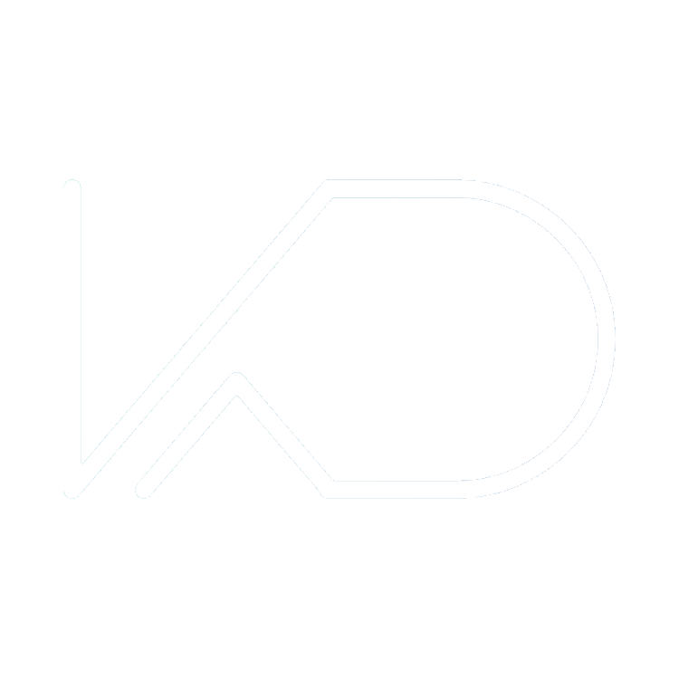

<!-- Profile Image -->

 

# Hello ✨  
## I'm **Kanishka Dutta** 🗿

> **` Live as if you were to die tomorrow. Learn as if you were to live forever. `**

  
  
  

---

I'm a passionate Full Stack Developer, game designer, and creative problem-solver who loves turning ideas into reality — whether it’s a sleek website, a fun mobile app, or an engaging game — you name it.

### 🧑‍💻 Full-Stack Developer  

From front-end UIs with <strong>Tailwind</strong>, <strong>React</strong>, and <strong>Bootstrap</strong>, to back-end magic with <strong>Node.js</strong>, <strong>Express</strong>, and databases like <strong>PostgreSQL</strong> or <strong>MongoDB</strong> — I enjoy crafting new projects and improving old ones.

### 🎮 Game Dev Enthusiast  

I'm building unique games that mash up genres — like Flappy Bird x Fruit Ninja, deckbuilding roguelikes, and Agar.io-style worlds — all powered by Unity, JavaScript, or whichever tool fits the vision.

### 🚀 On a Mission  

I run <strong>Vertex Studios</strong> — an indie, student-driven game studio helping students and graduates gain real-world experience by collaborating on dream projects. My mission: Build, learn, and share it with the world.

### 📚 Always Learning  

I dive into new tech, APIs, blockchain tools, and experiment through hackathons and creative side projects. If there’s a problem, I'm probably prototyping a solution right now.

## 📊 GitHub Stats

  

  
  &nbsp;
  

  

## 🗂️ About Me

- 🔭 Currently working on [Vertex Studio Canada](https://vertexstudio.ca/)
- 🌱 Currently learning **Angular**
- 📫 Reach me at **Kdutta2017@outlook.com**

## 📫 Connect with Me

  

-

## 🛠️ Languages & Tools

  
  
  
  
  <!-- Continue adding more icons here, matching this style -->

